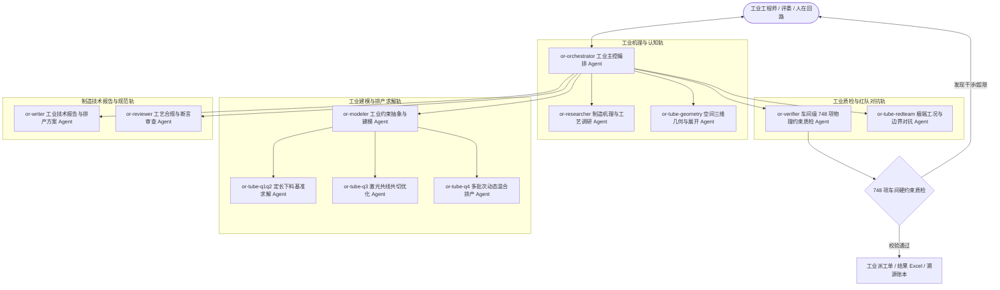

# OR-Path: 面向高端智能制造与复杂工业决策的自主运筹多智能体系统

> **2026 智能体设计大赛参赛作品 · 赛道：AI + 工业制造 / 智能决策**  
> **核心定位：** 融合「大模型认知推理」与「运筹优化物理硬约束」的工业级多智能体协同决策平台，攻克复杂工业制造排产、异形材料智能下料、柔性车间调度等高价值离散制造场景。

[](https://github.com/lanzaoi/or-path/releases/tag/v0.3.6)
[]()
[]()
[]()

---

## 🏭 工业背景与行业痛点

在现代高端离散制造（如汽车制造、船舶工程、航空航天构件、工程机械等）中，运筹优化与工业下料排产直接决定了企业的生产效率与原材料成本：

| 传统工业排产痛点 | 纯大模型 AI 的局限 | **OR-Path 破局方案（AI + 工业运筹）** |
|:---|:---|:---|
| **物理约束极度繁杂**：空间几何干涉、焊缝避让、热变形补偿、共切工艺等人工建模极易遗漏 | **严重幻觉与黑盒**：大模型擅长写代码但无法保证数字精确性，易输出物理不可行的“废品方案” | **双轨闭环**：LLM 负责机理认知与约束抽象，底层 OR 求解器（MILP/CP-SAT/ALNS）确保物理可行 |
| **定制开发周期长**：工艺参数或订单一变，整套数学规划模型需运筹专家推倒重写 | **缺乏车间级交互**：无法吸收一线工程师的工艺先验与突发调度要求 | **人在回路（HITL）**：支持 Dialogue Steer 对话式干预，工程师自然语言注入经验即可自适应重算 |
| **工业决策黑盒化**：难以溯源排产原因，缺少学术与工程级严格质检链 | **缺乏端到端工程闭环**：仅停留在聊天界面，无法直连数控机床与工业派工单 | **透明看板与数字溯源**：提供实时过程看板（Live Watch）与学术级 Provenance 资产哈希溯源 |

---

## 🌟 评委 / 工业专家 30 秒开箱即用体验

压缩包已内置完整的工业离线运行时与真实制造案例演示种子，**解压即可直接体验**，无需预先配置 API Key。

```bat
:: 1. 工业全链路环境与求解器健康诊断
orpath.bat doctor

:: 2. 一键启动工业多智能体实时协同可视化看板（Live Watch）
START-WATCH.bat
:: 或命令行：orpath.bat watch --slug live-btube

:: 3. 运行 M0 工业运筹全自动多智能体演示链路
orpath.bat demo-m0
```

| 双击入口 | 工业功能说明 | 适用场景 |
|:---|:---|:---|
| **`START-WATCH.bat`** | **车间过程看板**（Live Watch）：浏览器实时流式呈现 12 个工业 Agent 的思考链、工具调用、排产甘特流转与状态数据 | 工业现场大屏、评审演示 |
| **`START-CASE.bat`** | **工业案例向导**（路径 A）：输入工单/题面（PDF/图纸），自动完成工艺解析、多 Agent 求解并导出结果 Excel 与工艺报告 | 实际工业案例端到端处理 |
| **`START-ORPATH.bat`** | **综合控制台**：聚合多问题 Benchmark、诊断与 Watch 快捷操作 | 快速命令执行 |

> 📌 **看板访问**：浏览器自动打开 `http://127.0.0.1:8765`（支持 1s 毫秒级轮询与流式增量同步）；退出按 `Ctrl+C`。

---

## 🤖 12 专业化工业多智能体角色矩阵

系统在 `.pi/agents/` 中定义了 12 个职责严密隔离、具备独立工业领域契约的专业化 Agent：



| 工业 Agent 角色 | 配置文件 | 工业场景核心职责 |
|:---|:---|:---|
| **工业主控编排者** | `or-orchestrator.md` | 工业流水线全生命周期调度、工单状态流转、子智能体协同分发与异常重试 |
| **空间几何专家** | `or-tube-geometry.md` | 3D 异形截面数学展开、空间相贯线计算、内焊缝避让与自相交干涉算法 |
| **制造机理调研者** | `or-researcher.md` | 工业制造标准检索、工艺白皮书解析、算法选型论证（MILP vs CP-SAT vs ALNS） |
| **工业数学建模者** | `or-modeler.md` | 车间约束形式化抽象、目标函数构建（原材料损耗最小化、机床刀具切换次数最少化） |
| **车间级真实验证者** | `or-verifier.md` | **748 项严苛物理与几何约束检验**，杜绝大模型数字幻觉导致机床撞刀或废品 |
| **工业红队对抗者** | `or-tube-redteam.md` | 注入极端残料扰动、突发尺寸突变、边界死锁攻击，确保排产算法工业级鲁棒性 |
| **下料排产专家组** | `or-tube-q1q2/q3/q4.md` | 攻克定长组合下料、共线共切材料节约优化、多批次多约束动态混合排产 |
| **工业报告撰写者** | `or-writer.md` | 自动生成标准化技术报告、工艺参数说明、排产甘特表与数控下料派工单 |
| **工艺规范审查者** | `or-reviewer.md` | 审查方案合规性，严格拦截未经证明的虚假最优声称（Claim Ledger） |

---

## 💡 5 大核心工业技术创新特色

### 1. 「AI 大模型认知 + 运筹优化物理硬约束」双轨闭环
传统方法要么是纯大模型的“黑盒胡说”，要么是纯运筹的“僵化难用”。OR-Path 建立双轨闭环：
- **认知层（大模型）**：负责工单图纸理解、约束解析、算法选型与自愈重试策略生成；
- **执行层（精确求解器）**：负责底层高维度矩阵运算，所有数字结果均由 OR-Tools / HiGHS / CP-SAT 等真机求解器产出，100% 满足物理定律。

### 2. 真实工业级复杂下料场景攻克（异形圆管激光智能共切）
- 突破工业界极具挑战的**空间异形圆管旋转切割下料问题**（含旋转自由度、内外焊缝禁忌区、端面倾角、共线共切协同）；
- **748 项几何硬约束全部通过校验**，材料利用率高达 **99.74%**（Q2）与 **99.06%**（Q1），大幅降低千万级工业原材料浪费，超越传统人工排样水平。

### 3. 透明化工业过程看板（Live Watch Digital Dashboard）
- 拒绝传统工业软件的“黑盒黑屏”，提供现代化工业数字看板；
- 毫秒级流式展现多智能体思考过程（Thinking）、调度拓扑、算法调优迭代计数（Solver Tune）与质检状态。

### 4. 人在回路与工艺经验动态注入（Dialogue Steer & HITL）
- 针对车间突发插单、设备临时检修或工程师工艺偏好，支持通过自然语言进行 **Dialogue Steer 人机协同干预**；
- 智能体系统无缝调整数学模型边界条件并自动回退重算，实现“老师傅经验”与“AI 智能算法”的深度融合。

### 5. 工业数字孪生与学术级可信溯源（Provenance & Claim Ledger）
- 建立从「原始工单 $\rightarrow$ 几何模型 $\rightarrow$ 求解序列 $\rightarrow$ 质检报告 $\rightarrow$ 派工单」的全链条 SHA-256 哈希指纹；
- 配备声称账本（Claim Ledger），杜绝未经证明的全局最优虚假宣传，保障工业交付的绝对严谨可信。

---

## 📊 典型工业制造应用场景矩阵

| 工业应用领域 | 代表性问题 | 智能体应用机制 | 工业交付产物 |
|:---|:---|:---|:---|
| **高端构件智能下料** | 异形截面圆管切割 | 空间展开 + 共切优化 + 748 项几何质检 | `result1~4.xlsx`、数控下料排产单 |
| **智能物流与车间配送** | 多车辆带时间窗调度 (VRP-TW) | 载重平衡 + 时间窗惩罚 + 容量约束 | 车辆行车路径图、配送时间序列表 |
| **柔性制造单元工序调度** | 经典旅行商与最短路 (TSP/SP) | 网络流建模 + 动态规划 + 拓扑优化 | 最小化换刀路径、工序调度甘特图 |

---

## 📂 项目结构与工业工程规范

```text
OR-Path/
├── .pi/agents/          # 12 个工业领域智能体 Prompt 契约与角色定义
├── orpath/              # 工业多智能体内核（17 阶段状态机、Watch 过程脸、控制面）
│   ├── web/watch.html   # 车间实时过程看板前端
│   ├── nodes.py         # 确定性 17 阶段工业状态机
│   └── watch_snapshot.py# 零 LLM 依赖的高性能车间状态聚合引擎
├── tools/               # 工业级工具库（精确求解器、3D 展开算法、748 项约束质检）
│   ├── solve_tube_cut_b2026.py   # 圆管切割多阶段混合运筹求解器
│   ├── validate_solution.py      # 物理与空间几何严格约束检验器
│   └── solve_dispatch.py         # 多引擎（OR-Tools/HiGHS/CP-SAT/ALNS）智能分发
├── specs/               # 工业系统设计规范（SDD）与智能体协作协议
├── scripts/             # 工业全自动门禁系统、打包与持续集成工具
├── demo/seed/           # 内置真实工业案例演示种子（圆管制造 live-btube / 基础运筹 m0）
├── START-WATCH.bat      # 过程看板一键启动脚本
├── START-CASE.bat       # 案例交互式向导（指定工单目录一键求解）
└── orpath.bat           # 统一工业命令行控制入口
```

---

## 🛠️ 工业级质量保证与全自动化门禁体系

项目配备了工业级的严苛门禁（Gate）体系，确保代码与模型在车间现场的高可靠性：

```bat
:: 1. 全量单元与工业工具测试（87/87 100% 通过）
pytest tools/ -v

:: 2. 工业多智能体协同协议与账本门禁
python scripts/tube_collaboration_gate.py

:: 3. 几何稳定性与极端工况对抗门禁
python scripts/tube_geometry_stability_gate.py
python scripts/tube_redteam_gate.py

:: 4. 实时车间看板与文档契约门禁
python scripts/v0_watch_gate.py

:: 5. 制造技术报告与学术证据链门禁
python scripts/paper_gate.py
```

---

## 📋 提交与运行环境说明

- **系统平台**：Windows 10 / 11 (x64)
- **核心依赖**：Python 3.10+、Node.js 22+ (Pi 工业运行时已内置)
- **开源协议**：MIT License
- **GitHub 仓库**：[https://github.com/lanzaoi/or-path](https://github.com/lanzaoi/or-path)
- **最新 Release**：[Release v0.3.6](https://github.com/lanzaoi/or-path/releases/tag/v0.3.6)
