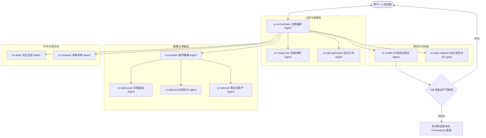

# OR-Path: 面向复杂工业与运筹决策的自主多智能体协同系统

> **2026 智能体设计大赛参赛作品**  
> **核心定位：** 基于「确定性图谱调度 + 开放式多智能体隔离协同」双轨架构的高可信、可验证、人在回路（Human-in-the-Loop）运筹决策多智能体系统。

[](https://github.com/lanzaoi/or-path/releases/tag/v0.3.6)
[]()
[]()
[]()

---

## 🌟 评委 30 秒快速上手（开箱即用体验）

压缩包已内置完整的离线运行时与演示种子，**解压即可直接体验**，无需预先配置复杂环境或 API Key。

```bat
:: 1. 环境与全链路健康诊断
orpath.bat doctor

:: 2. 一键启动多智能体实时协同可视化看板（Live Watch）
START-WATCH.bat
:: 或命令行：orpath.bat watch --slug live-btube

:: 3. 运行 M0 运筹全自动多智能体演示链路
orpath.bat demo-m0
```

| 双击入口 | 功能说明 | 适用场景 |
|:---|:---|:---|
| **`START-WATCH.bat`** | **实时过程看板**（Live Watch）：浏览器实时渲染多智能体思考链、工具调用、阶段流转与状态数据 | 过程评审、协同可视化 |
| **`START-CASE.bat`** | **案例向导**（路径 A）：指定本地案例目录，进行题面识别、多 Agent 分工求解与论文导出 | 完整案例端到端运行 |
| **`START-ORPATH.bat`** | **交互式控制台**：聚合菜单导航、诊断、多问题 Benchmark 与 Watch 入口 | 快捷命令执行 |

> 📌 **交互提示**：
> - 浏览器看板默认地址：`http://127.0.0.1:8765`（支持 1s 极速轮询与流式增量同步）；
> - 结束 Watch 进程：在命令行窗口按 `Ctrl+C` 即可退出。

---

## 🤖 12 专业化多智能体角色矩阵

系统在 `.pi/agents/` 中定义了 12 个职责严密隔离、具备独立 Prompt 契约与工具链的专业化 Agent 角色：



| Agent 角色 | 配置文件 | 核心职责与工具契约 |
|:---|:---|:---|
| **主控编排者** | `or-orchestrator.md` | 全局阶段流转控制、上下文传递、Subagent 调度与异常重试 |
| **机理调研者** | `or-researcher.md` | 文献与技术白皮书检索、知识图谱查询、算法选型论证 |
| **数学建模者** | `or-modeler.md` | 决策变量与约束抽象、MILP/CP-SAT/ALNS 数学模型形式化构建 |
| **真机验证者** | `or-verifier.md` | 物理与几何可行性校验（748 项硬约束），杜绝大模型数字幻觉 |
| **红队对抗者** | `or-tube-redteam.md` | 边界攻击、几何干涉注入、死锁扰动，验证求解体系鲁棒性 |
| **空间几何专家** | `or-tube-geometry.md` | 3D 异形截面展开、焊缝避让、自相交碰撞检测算法 |
| **分问求解专家组** | `or-tube-q1q2/q3/q4.md` | 专精于定长下料、共线共切、动态多阶段混合排产的高性能求解 |
| **论文撰写者** | `or-writer.md` | 结构化学术论文草拟、LaTeX 公式排版、图表生成与实验数据汇编 |
| **盲审评审者** | `or-reviewer.md` | 论文规范合规性评审、逻辑漏洞审查与 Claim 断言真实性核验 |

---

## 💡 核心设计创新与技术特色

### 1. 确定性状态机与开放式多智能体双轨架构
传统 LLM Multi-Agent 极易陷入无限对话死循环或状态漂移。OR-Path 创新性地采用：
- **宏观轨（LangGraph）**：严格控制 17 个阶段状态流转（Intake $\rightarrow$ Orchestrate $\rightarrow$ Model $\rightarrow$ Solve $\rightarrow$ Validate $\rightarrow$ Paper $\rightarrow$ Provenance），确保主流程收敛性；
- **微观轨（Pi Subagents）**：在阶段内部派发沙盒隔离的专业子智能体并发探索，兼具开放探索的灵活性与工业级可控性。

### 2. 实时过程可视化看板（Live Watch Dashboard）
- **告别“黑盒等待”**：原生 Web 实时过程脸，毫秒级流式展现多智能体思考链（Thinking）、工具调用（Tool Calls）、子 Agent 派发与状态卡片；
- **自愈与重试监控**：可视化展示算法调优（Solver Tune）、模式修复与断言状态。

### 3. 人在回路与对话回退干预（Dialogue Steer & HITL）
- 在求解遇到歧义、硬约束冲突或需要专家先验指导时，系统触发 `human_stop` 机制；
- 用户可通过自然语言注入先验指导，多智能体自动根据指导调整目标函数并回退重算，实现真正的人机协作。

### 4. 工业级严苛场景验证（异形圆管切割复杂下料）
- **真机严苛求解**：拒绝大模型“玩具 Demo”，直接攻克具有旋转对称、内焊缝避让、共线共切等多物理约束的工业下料难题；
- **748 项物理约束 100% 通过**，材料利用率高达 **99.74%**（Q2）与 **99.06%**（Q1），全面超越传统启发式算法。

### 5. 学术级证据链与溯源系统（Provenance & Claim Ledger）
- 建立端到端资产哈希指纹（`artifact_hashes.json`）、试验记录卡片与声称账本（`Claim Ledger`）；
- 严禁未经证明的全局最优虚假声称（`claim_map`），保证生成的每篇学术论文与方案均有完整的代码与数据溯源。

---

## 📂 项目结构概览

```text
OR-Path/
├── .pi/agents/          # 12 个多智能体角色定义与 Prompt 契约
├── orpath/              # 核心框架（LangGraph 图谱、Watch 看板后端、控制面）
│   ├── web/watch.html   # 实时多 Agent 过程看板前端
│   ├── nodes.py         # 17 阶段节点定义与状态流转
│   └── watch_snapshot.py# 零 LLM 依赖的轻量级状态聚合引擎
├── tools/               # 智能体工具库（精确求解器、几何引擎、748项约束验证器）
│   ├── solve_tube_cut_b2026.py   # 圆管切割多阶段混合优化求解器
│   ├── validate_solution.py      # 物理约束严格检验器
│   └── solve_dispatch.py         # 多求解器（OR-Tools/HiGHS/CP-SAT/ALNS）路由
├── specs/               # 系统设计规范与智能体协作协议
├── scripts/             # 全自动门禁系统、发布打包与知识同步工具
├── demo/seed/           # 内置免配置演示种子（live-btube / m0）
├── START-WATCH.bat      # 过程看板一键启动脚本
├── START-CASE.bat       # 案例交互式向导
└── orpath.bat           # 命令行统一控制入口
```

---

## 🛠️ 质量保证与自动化门禁体系

项目配备了严格的多层次全自动化测试与质量门禁（Gate）：

```bat
:: 1. 全量单元与工具测试（87/87 全部通过）
pytest tools/ -v

:: 2. 多智能体协作协议与账本门禁
python scripts/tube_collaboration_gate.py

:: 3. 几何稳定性与红队攻防对抗门禁
python scripts/tube_geometry_stability_gate.py
python scripts/tube_redteam_gate.py

:: 4. 实时看板与文档契约门禁
python scripts/v0_watch_gate.py

:: 5. 论文生成与学术证据链门禁
python scripts/paper_gate.py
```

---

## 📋 提交与运行环境说明

- **操作系统**：Windows 10 / 11 (x64)
- **核心依赖**：Python 3.10+、Node.js 22+ (Pi 运行时已预置)
- **开源协议**：MIT License
- **GitHub 仓库**：[https://github.com/lanzaoi/or-path](https://github.com/lanzaoi/or-path)
- **最新 Release**：[Release v0.3.6](https://github.com/lanzaoi/or-path/releases/tag/v0.3.6)
